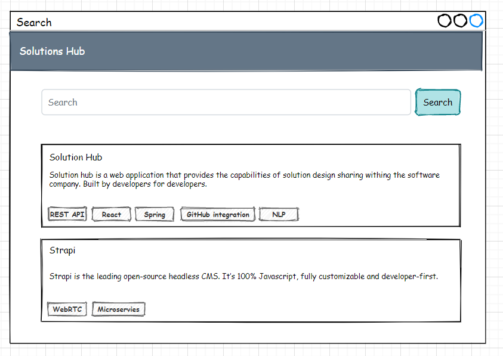
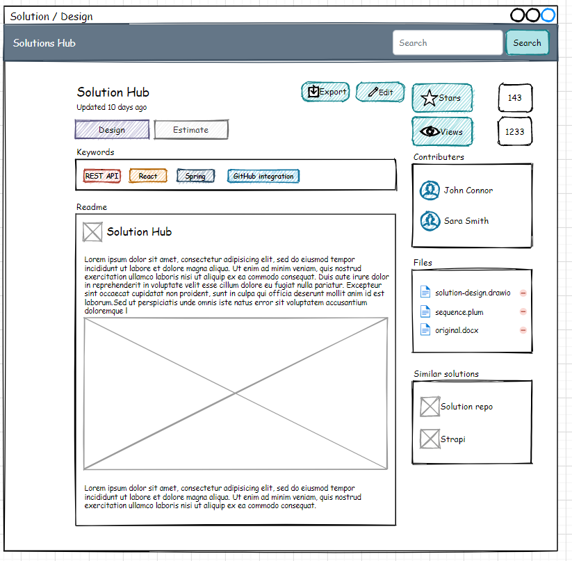
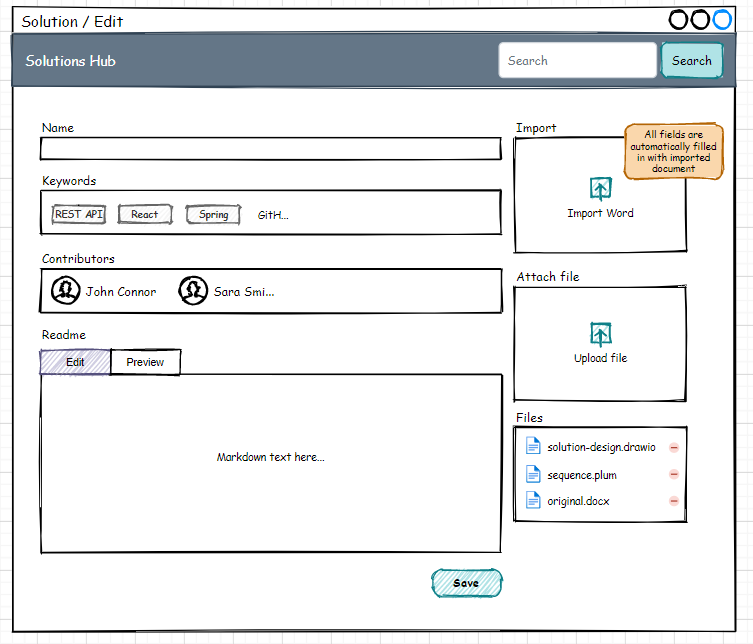

# Solutions Hub
## Introduction

Software engineers build and implement different solutions every day.
Many of those solutions are reinvented many times in different projects.
There are several reasons for that like different contexts, projects
specific use cases, etc. Although reinventing is a not a problem itself,
the effort that engineers need to take in order to achieve the idea or
concept of a solution, find the right library or framework, or at least
create the appropriate mind map of technology keywords is a problem.
Furthermore, some solutions include project specific information that
cannot be shared in public like on GitHub or Medium. Hence, there is a
clear need to the solution that helps software develops to share their
ideas and finds within their company for others to decrease the solution
implementation effort.

*Atlassian Confluence* product seems the right solutions for the
problem, but in reality, it's too heavy and overcomplicated for quick
idea sharing that makes it's not the best fitting tool.

## Problem

Solutions Hub is aimed to solve the following problems within a software
developing company:

1.  Lack of general company knowledge base.

2.  Lack of cross project solutions/ideas/knowledge sharing.

3.  Lack of solution feedback from other colleagues.

4.  Need to share knowledge in chats like Skype or Slack where it's
    almost impossible to find later.

To do that, Solutions Hub provides the following functionality:

1.  Ability to quickly publish and share solution written in markdown
    format.

    a.  Ability to upload existing solution in Word file (docx) and
    convert it into markdown including media files.

2.  Ability to quickly search solution.

3.  Ability to praise and being praised for solution.

4.  Ability to quickly get into contact with solution contributor.

5.  Integration with existing organization's back office system (like
    PM).

## Solution

### UX

|Page|Components|Actions|
|-----------------|------------------------------|------------------------------------------------------|
|Main page        |Search input, solutions list  |Search solutions by name, keywords, content|
|Solution design  |Solution design               |Export solution, edit solution (by contributor only)|

