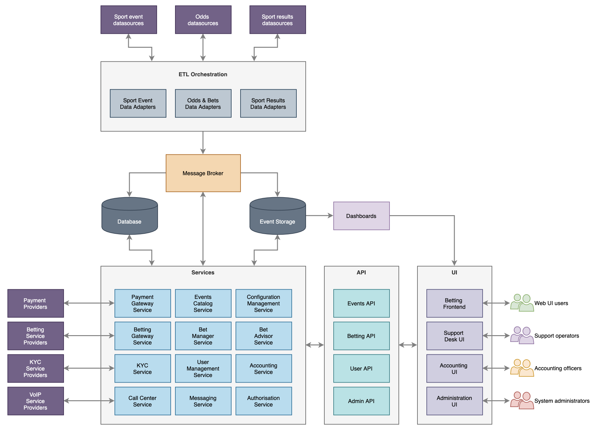
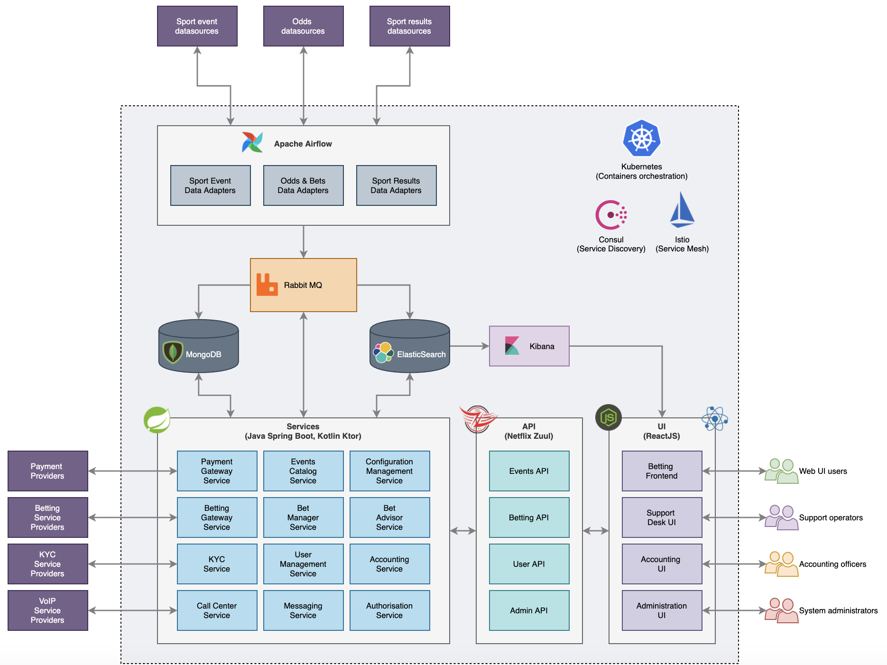
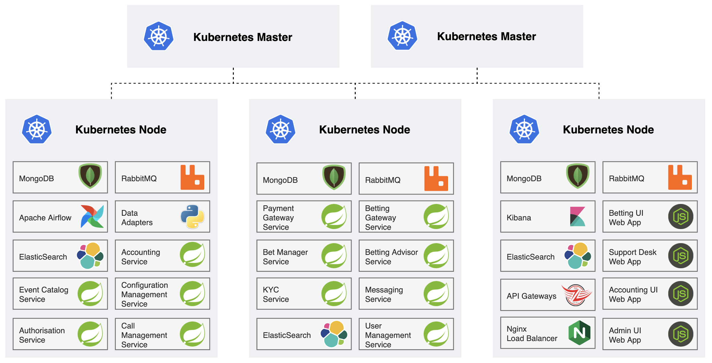

# 

This document describes the initial proposal of the Foras Betting System
architecture.

The following targets and assumptions were taken into account:

-   System should be designed and built using modern open source tools
    and technologies with free and open licenses

-   System should be designed having in mind reliable and fault tolerant
    architectural approaches and patterns

-   Despite of the fact that current load and performance targets are
    not dramatically high, it should be possible to upgrade the System
    in future for bigger load without costly changes and significant
    refactoring

-   It should be possible to deploy and run the System on any on-prem
    environment without specific cloud vendors requirements or
    limitations

-   System components should be easily monitored and maintained

## Logical System Architecture Overview

The picture above shows the following main layers of the proposed
technical solution:

**ETL Orchestration** - where data ingestion components are implemented.
System needs to be feeded by data from many sources - sport events,
odds, bets, results etc. Those sources provide data in different formats
and with different transports. Some data feeds need to be invoked
periodically, some need to be subscribed by our system.

**Message Broker** - 3rd-party system responsible for implementation of
enterprise messaging patterns across all the systems. Various components
may publish messages and subscribe on message topics within it.

Message broker receives all data feeds updates from adapters, delivers
data to data storages and allows other components to be aware of
specific types of events in the System.

**Data Storage** - database containing all the system entities (user
profiles, data channels configuration details, users’ betting details,
payment transactions details etc.)

**Event Storage** - another storage optimized for fast constant data
ingestion (mostly write-only, no updates). Keeps raw events “as is” for
future analytical processing. Also responsible for storing logs and
monitoring information from all components in the System.

**Dashboards** - graphical service to build various charts and diagrams
automatically using the Event storage datasets. Such charts and diagrams
could be used in the UI applications.

**Services** - the System core functionality consists of a number of
back-end components (microservices) providing different sets of
functions. Services interact with each other and surrounding systems
directly via REST and GRPC protocols or asynchronously using messaging
protocol provided by the Message Broker.

The full list of services could be thoroughly clarified during the
solution design phase, but here is the preliminar list:

-   **Events Catalog Service**: keeps the database of all sport events,
    results and odds. Could be queried to build betting programs on the
    System website (Betting Front-end)

-   **Configuration Management Service**: provides methods to manage
    configuration of all system components.

-   **Betting Manager Service**: provides methods to place bets

-   **Betting Advisor Service**: analytical service responsible for
    betting suggestions based on odds information form different betting
    providers. Could be used for hedging and arbitration

-   **User Management Service**: provides method to manage user profile
    data

-   **Accounting Service**: prepares data for accounting analysis
    comparing money flows from different sources,

-   **Messaging Service**: responsible for interaction with customers
    via message chats

-   **Authorisation Service**: provides methods to authenticate and
    authorize connected parties and manage their level of system access
    with roles and permissions.

-   **Payment Gateway Service**: responsible for interactions with
    payment providers to top-up and withdraw funds on user accounts.

-   **Betting Gateway Service**: provides common interfaces to place
    hedging bets manually or automatically using APIs from different
    betting providers

-   **KYC Service**: responsible for interactions with 3rd party KYC
    providers

-   **Call Center Service**: provides VoIP functionality (using 3rd
    party systems) for Support Desk voice service

**API** - UI applications and other systems should not directly interact
with the internal system services. Instead there is another mediation
layer - API Gateway. This layer contains several API facades providing
methods for direct and asynchronous communication with the System
backend services:

-   **Events API** - all methods to receive information about the system
    events - sport timetables, results, odds etc.

-   **Betting API** - methods to place bets in the system and examine
    actual and historical bet results

-   **User API** - interface to user profile management and surrounding
    data including authorisation and role based access

-   **Admin API** - provides interface to the System configuration
    methods

**UI** - System includes several UI applications built for different
types of users:

-   **Betting Frontend** - main entrance point for the System customers
    where they may examine sport events, place bets, check results and
    manage their personal configuration details

-   **Support Desk UI** - internal system operator workplace to manage
    users bets and profile details. Also provides messaging and voice
    calls management capabilities.

-   **Accounting UI** - internal application with monitoring and
    reporting functionality to examine funds movement.

-   **Administration UI** - general UI for system configuration
    management.

##  

## Implementation Proposal Details

The following picture illustrates exact tools and technologies that
could be used to build the System:

|                                              |                                                                                                                                                                   |
|----------------------------------------------|-------------------------------------------------------------------------------------------------------------------------------------------------------------------|
| **Component**                                | **Implementation**                                                                                                                                                |
| ETL Orchestration                            | Apache Airflow - open source platform to build, monitor and manage generic workflows                                                                              |
| Data adapters (sports events, betting, odds) | Python scripts - Apache Airflow operators                                                                                                                         |
| Message Broker                               | Apache RabbitMQ - one of the most popular open source message brokers supporting AMQP protocol                                                                    |
| Data Storage                                 | MongoDB - general purpose document-based distributed database                                                                                                     |
| Event Storage                                | ElasticSearch - fast distributed analytical platform providing rich data storage and search capabilities.                                                         |
| Dashboards                                   | Kibana - free open user interface targeted on ElasticSearch data visualisation                                                                                    |
| Services                                     | Java Spring Boot - widely used JVM based open source platform for development and deployment of microservice components.                                          |
| API Gateway                                  | Netflix Zuul - popular open source API gateway framework                                                                                                          |
| UI applications                              | ReactJS - popular open source framework for development of interactive user interfaces in Javascript and Typescript                                               |
| Container management platform                | Kubernetes - standard de facto in enterprise container management. Open source platform supported by Google                                                       |
| Service Discovery                            | Hashicorp Consul - service networking solution to automate network configurations, discover services, and enable secure connectivity across any cloud or runtime. |
| Service Mesh                                 | Istio - open source independent service mesh that provides a uniform way to secure, connect, and monitor microservices                                            |

The following picture presents an example Deployment scenario with the
Kubernetes container management platform:

